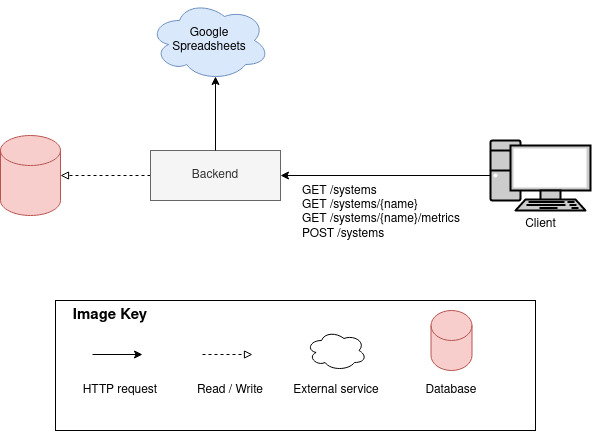
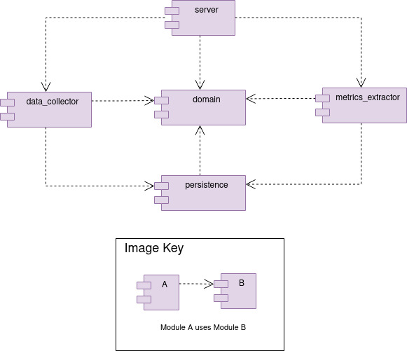
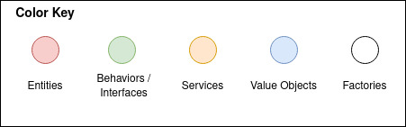
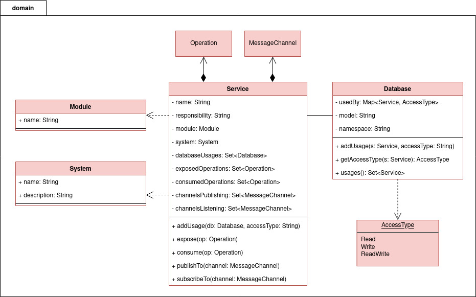
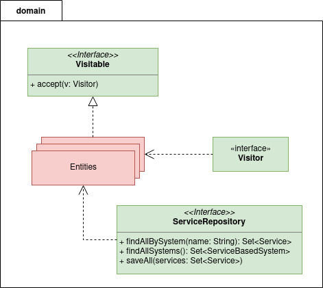
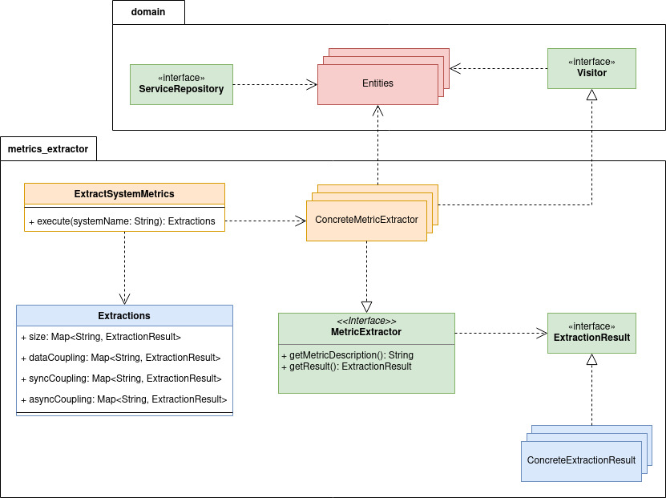
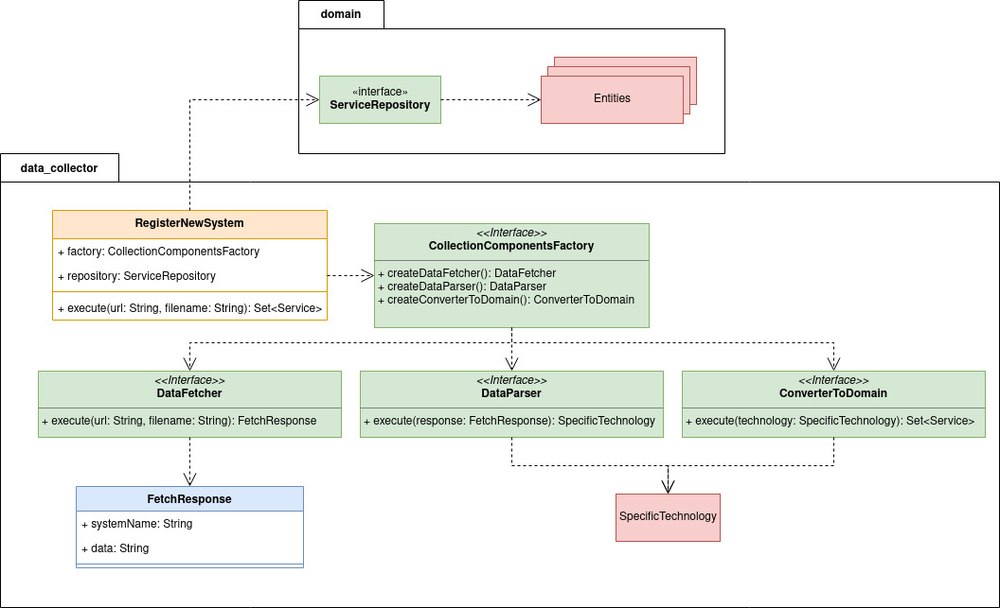
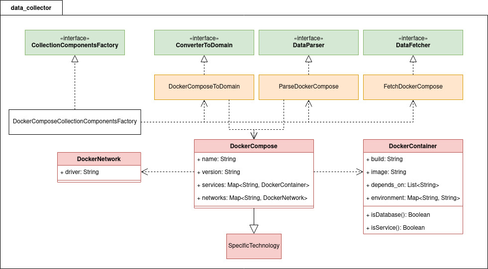

# Sorting Hat's Backend

The Sorting Hat's backend is responsible for collecting service-based system data and extracting CharM metrics.

## How to run

Step 1) Create a `.env` file based on the `.env.sample` in this repository.
Make sure you set the `DB_HOST` value correctly
(`localhost` or `db`, depending on how you will run the application -- see step 3).

Step 2) Run the following command to start the database:
```shell
docker-compose up db
```

Step 3) You can run the application on your local machine (if you have JDK installed) or on docker.

On a local machine:
```shell
./gradlew clean build
./gradlew :server:shadowJar
java -jar server/build/libs/server-0.0.1-SNAPSHOT-all.jar
```

On docker:
```shell
docker-compose build     # to build the app image
docker-compose up app    # to run db and app containers
```


## Technologies

- Kotlin language
- Spring Boot Framework
- MongoDB
- JUnit5 and Mockito for tests
- Gradle

## Backend overview



Every time the backend is started, it fetches systems' data manually collected from a spreadsheet and saves those that have not yet been saved in the database.

The endpoints are as follows:

- `GET /systems`: to get all systems registered in the tool.
- `GET /systems/{name}`: to get more detailed information of a specific system with name `name`.
  - Example: `GET /systems/InterSCity`.
- `GET /systems/{name}/metrics`: to extract and get the CharM metrics of a specific system with name `name`.
  - Example: `GET /systems/TrainTicket/metrics`.
- `POST /systems`: to collect system data from a remote repository.
- `PUT /systems/{name}/endpoints`: to register services endpoints.

Example of a request body for `POST /systems`:
```json
{
  "repoUrl": "https://github.com/codelab-alexia/buscar-hackathon",
  "filename": "docker-compose.yaml"
}
```

Example of a request body for `PUT /systems/fictional-system/endpoints`:
```json
{
  "repoUrl": "https://github.com/myorg/fictional-system",
  "servicesAndOpenApiFilenames": [
    {
      "serviceName": "user-service",
      "openApiFilename": "user-service-openapi.yaml"
    },
    {
      "serviceName": "order-service",
      "openApiFilename": "order-service-openapi.yaml"
    }
  ]
}
```

## Modules architecture

The backend is composed by the modules as follows:



- `domain`: contains the core entities used by other modules.
- `data_collector`: responsible for collecting service-based systems' data. Currently, it collects data from docker-compose files.
- `metrics_extractor`: responsible for extracting CharM metrics from systems collected by `data_collector`.
- `persistence`: handle saving systems' data in a MongoDB and accessing them. It is shared by `data_collector` and `metrics_extractor`.
- `server`: starts an HTTP Web Server and connects the other modules. It is the entry point of the application.

## Internal Architecture

All images follow the color key below:



### Domain





### Metrics Extractor



### Data Collector





